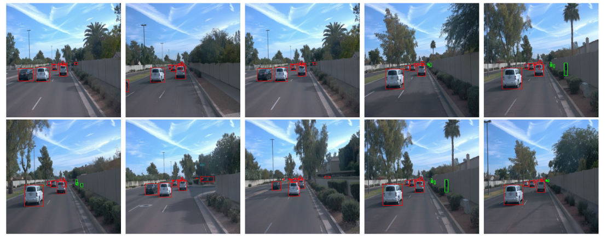
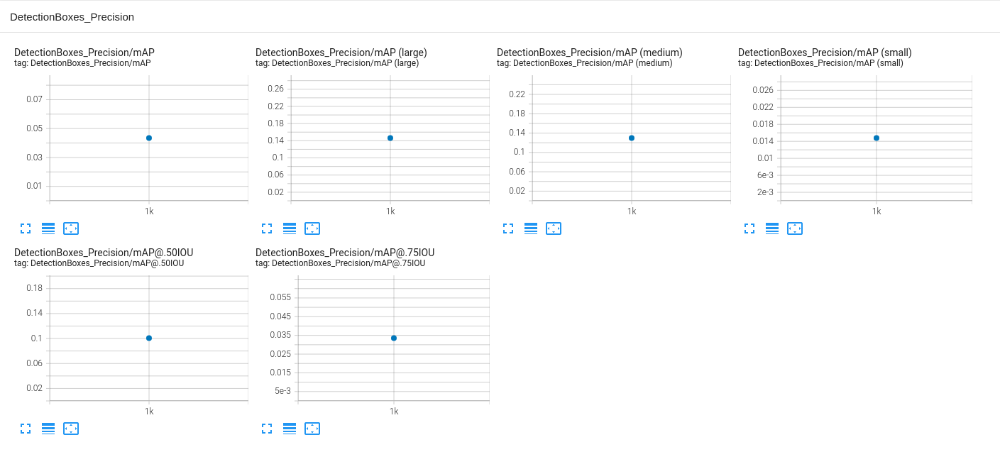
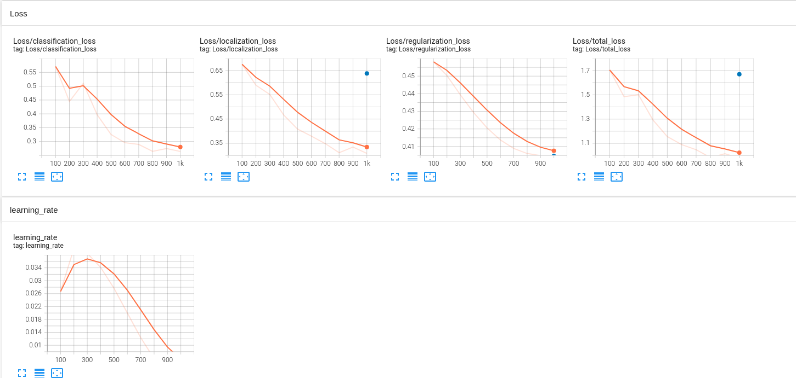

# Object Detection in an Urban Environment
This is part of Udacity Self Driving Car (SDC) project. Camera
## Data

For this project, we will be using data from the [Waymo Open dataset](https://waymo.com/open/).  
The Waymo Open dataset contains camera images, lidar range images which are labeled with classes and bounding boxes.   
Please check their [site](https://waymo.com/open/) if you would like to use their dataset for study purpose.
## Setup
* It is recommended to use docker image to run this repository as it depends on many modules. Follow this [link](https://docs.docker.com/engine/install/ubuntu/) to install docker into your machine. Also please read [this documentation](https://docs.nvidia.com/datacenter/cloud-native/container-toolkit/install-guide.html) from Nvidia to use gpu support in docker.
* Next, clone this repository in your local project directory. This will create `\study_sdc_p1\` directory. 
    ```
    git clone https://github.com/HyungunKim/nd013-c1-vision-starter.git
    ```
* The docker image for this project is [here](https://hub.docker.com/repository/docker/dkrhkkim/ndsdc). Run the codes in the terminal, **inside**  the cloned repository directory.
    ```
  sudo docker run --gpus all -v `pwd`:/app/project/ -ti --rm -p 8888:8888 dkrhkkim/ndsdc:new bash
  ```
### Data
* The Open Waymo Dataset is large and is not included in the image. It should be created in `nd013-c1-vision-starter/data/waymo/processed`. You can download in your workspace with 
    ```
    mkdir -p ./data/waymo/
    python download_process.py --data_dir ./data/waymo/
    ```
* Next, organize the processed data as in the structure described below.
```
study_sdc_p1/data/waymo
	- training_and_validation - contains 97 files to train and validate your models
    - train: contain the train data (empty to start)
    - val: contain the val data (empty to start)
    - test - contains 3 files to test your model and create inference videos
```

 `training_and_validation` data into `train`, and `val` sets by completing and executing the `create_splits.py` file.


### Experiments
The experiments folder are organized as follow:
```
study_sdc_p1/experiments/
    - pretrained_model/
    - exporter_main_v2.py - to create an inference model
    - model_main_tf2.py - to launch training
    - reference/ - reference training with the unchanged config file
    - augmentation/ - create a new folder for each experiment you run
    - label_map.pbtxt
    ...
```

## Exploratory Data Analysis

Some basic facts about the images in the datasets are as follows.
* The image shape is 640 x 640 x 3 (width, height, channel)
* The pixel values ranges from 0~255
* There are 3 classes namely `Car`, `Pedestrian`, `Cyclist`

Below shows 10 random samples from `segment-1005081002024129653_5313_150_5333_150_with_camera_labels.tfrecord`.

As you can see These images look very similar despite the fact they are randomly shuffled. This is because in this driving episode the road is straight, scenery is similar, other vehicles drive at similar speed.  

### Create the training - validation splits
To split the data into training, validation and training sets follow the instructions below.
* create three subfolders: `study_sdc_p1/data/train/`, `study_sdc_p1/data/val/`, and `study_sdc_p1/data/test/`
* split the tf records files between these three folders by symbolically linking the files from `study_sdc_p1/data/waymo/` to `study_sdc_p1/data/train/`, `study_sdc_p1/data/val/`, and `study_sdc_p1/data/test/`
* The splitting ratios between `train` / `val` / `test` is `70%` / `15%` / `15%` 

Finally, use the following command to run the script to split the datasets:
```
python create_splits.py --data-dir /home/workspace/data
```

### Edit the config file

The Tf Object Detection API relies on **config files**. The config that we will use for this project is `pipeline.config`, which is the config for a SSD Resnet 50 640x640 model. You can learn more about the Single Shot Detector [here](https://arxiv.org/pdf/1512.02325.pdf).

First, download the [pretrained model](http://download.tensorflow.org/models/object_detection/tf2/20200711/ssd_resnet50_v1_fpn_640x640_coco17_tpu-8.tar.gz) and move it to `study_sdc_p1/experiments/pretrained_model/`.

Editing the config files is not mandatory as it is already in this git repository.  

FYI you can edit the config files to change the location of the training and validation files, as well as the location of the label_map file, pretrained weights. We also need to adjust the batch size. To do so, run the following inside the project directory:
```
python edit_config.py --train_dir ./data/train/ --eval_dir ./data/val/ --batch_size 2 --checkpoint ./experiments/pretrained_model/ssd_resnet50_v1_fpn_640x640_coco17_tpu-8/checkpoint/ckpt-0 --label_map ./experiments/label_map.pbtxt
```
A new config file will be created, `pipeline_new.config`.

### Training
The first training is used for reference purpose as we will compare it to other training experiments. 
  
If you are following along you can launch your reference experiment with the Tensorflow object detection API. Move the `pipeline_new.config` to the `study_sdc_p1/experiments/reference` folder. Now launch the training process:
* a training process:
```
python experiments/model_main_tf2.py --model_dir=experiments/reference/ --pipeline_config_path=experiments/reference/pipeline_new.config
```
Once the training is finished, launch the evaluation process:
* an evaluation process:
```
python experiments/model_main_tf2.py --model_dir=experiments/reference/ --pipeline_config_path=experiments/reference/pipeline_new.config --checkpoint_dir=experiments/reference/
```

**Note**: Both processes will display some Tensorflow warnings, which can be ignored. You may have to kill the evaluation script manually using
`CTRL+C`.

To monitor the training, you can launch a tensorboard instance by running `python -m tensorboard.main --logdir experiments/reference/ --host 0.0.0.0`.  

The reference training results are as follows.

As you can see from the mAP score, the result is pretty bad. This may be due to the fact that the training loss almost half of validation loss as shown below.


### Improve the performances

The initial experiment did not yield optimal results. However, we can use data augmentation. One obvious change consists in improving the data augmentation strategy. The [`preprocessor.proto`](https://github.com/tensorflow/models/blob/master/research/object_detection/protos/preprocessor.proto) file contains the different data augmentation method available in the Tf Object Detection API. To help you visualize these augmentations, we are providing a notebook: `Explore augmentations.ipynb`. Using this notebook, try different data augmentation combinations and select the one you think is optimal for our dataset. Justify your choices in the writeup.

Keep in mind that the following are also available:
* experiment with the optimizer: type of optimizer, learning rate, scheduler etc
* experiment with the architecture. The Tf Object Detection API [model zoo](https://github.com/tensorflow/models/blob/master/research/object_detection/g3doc/tf2_detection_zoo.md) offers many architectures. Keep in mind that the `pipeline.config` file is unique for each architecture and you will have to edit it.

**Important:** If you are working on the workspace, your storage is limited. You may to delete the checkpoints files after each experiment. You should however keep the `tf.events` files located in the `train` and `eval` folder of your experiments. You can also keep the `saved_model` folder to create your videos.


### Creating an animation
#### Export the trained model
Modify the arguments of the following function to adjust it to your models:

```
python experiments/exporter_main_v2.py --input_type image_tensor --pipeline_config_path experiments/reference/pipeline_new.config --trained_checkpoint_dir experiments/reference/ --output_directory experiments/reference/exported/
```

This should create a new folder `experiments/reference/exported/saved_model`. You can read more about the Tensorflow SavedModel format [here](https://www.tensorflow.org/guide/saved_model).

Finally, you can create a video of your model's inferences for any tf record file. To do so, run the following command (modify it to your files):
```
python inference_video.py --labelmap_path label_map.pbtxt --model_path experiments/reference/exported/saved_model --tf_record_path /data/waymo/testing/segment-12200383401366682847_2552_140_2572_140_with_camera_labels.tfrecord --config_path experiments/reference/pipeline_new.config --output_path animation.gif
```

## Submission Template

### Project overview
This section should contain a brief description of the project and what we are trying to achieve. Why is object detection such an important component of self driving car systems?

### Set up
This section should contain a brief description of the steps to follow to run the code for this repository.

### Dataset
#### Dataset analysis
This section should contain a quantitative and qualitative description of the dataset. It should include images, charts and other visualizations.
#### Cross validation
This section should detail the cross validation strategy and justify your approach.

### Training
#### Reference experiment
This section should detail the results of the reference experiment. It should includes training metrics and a detailed explanation of the algorithm's performances.

#### Improve on the reference
This section should highlight the different strategies you adopted to improve your model. It should contain relevant figures and details of your findings.
